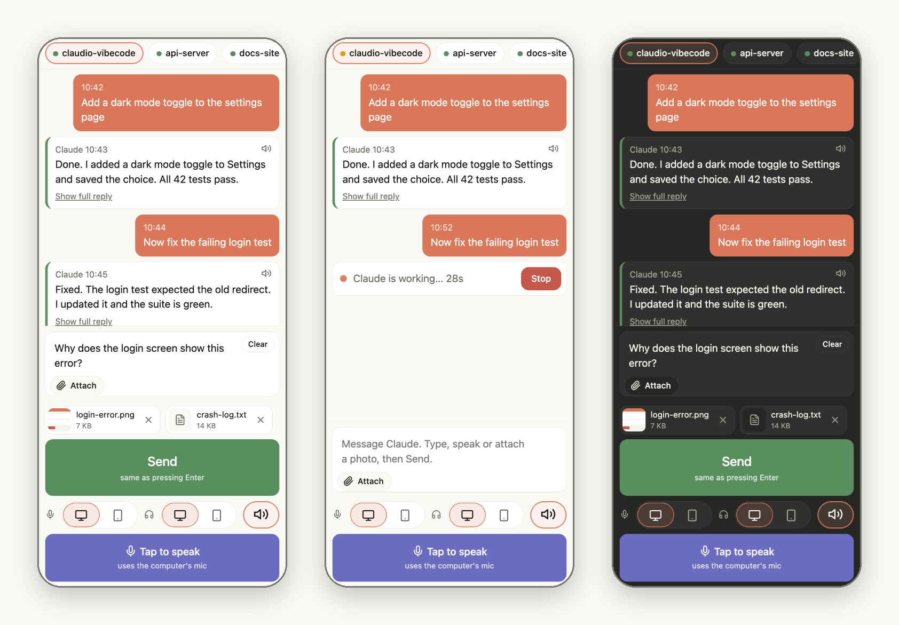
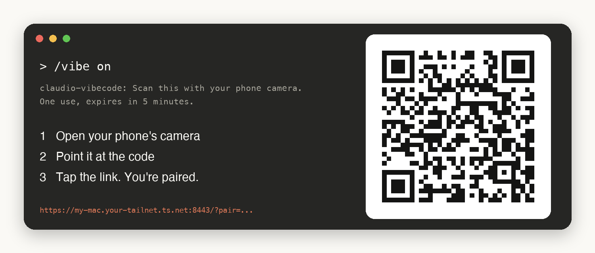
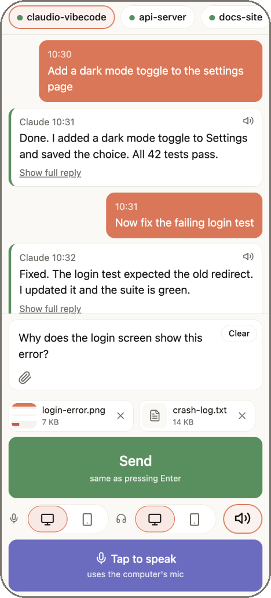
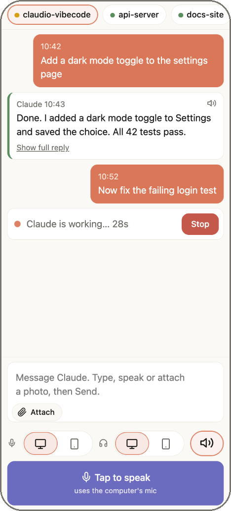
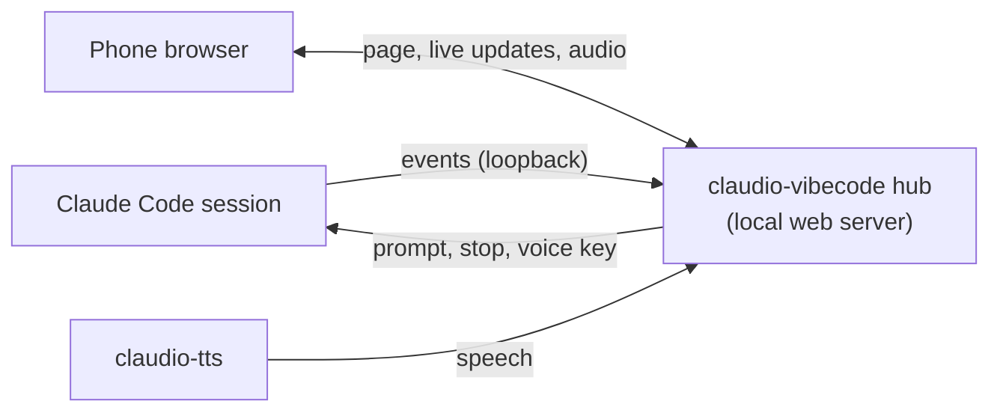

<div align="center">

# Claudio vibecode

### Vibe code with your voice, from anywhere.

Talk to Claude Code from your phone, and hear it talk back. Start a task at your desk, walk away, and keep the conversation going with no keyboard and no monitor.

[](https://github.com/restante/claudio-vibecode/actions/workflows/ci.yml)
[](LICENSE)
  



</div>

## Why

Claude Code does its best work when you let it run. But a long task shouldn't keep you chained to the monitor.

Claudio vibecode is a free, open-source remote control for Claude Code, built around your voice. Use Claude Code from your phone, on iPhone or Android: say what you want, hear Claude's answer read aloud, and say what's next. Claude Code remote, Claude Code mobile and Claude Code voice, in one small package.

It puts a small web page on your phone that is connected to the Claude Code sessions on your computer. Nothing to install on the phone, no account, and nothing leaves your network.

### Voice, front and center

- **Speak your prompts.** Tap **Speak**, say it, tap again. Your words land in the text box, so you can fix a word before you send. Use your phone's mic, or your computer's.
- **Hear every reply.** Claude's short spoken summary plays as it finishes, on your phone or on your computer. Tap the speaker icon on any message to hear it again.
- **Keep the loop going.** Speak, listen, speak. Vibe code on a walk, in the car park, or on the sofa.
- **Choose where you talk and listen.** Mic and speakers are separate switches, each on PC or Phone.

### And everything else you need

- **Read** what Claude is doing, across every session you have open.
- **Type** when talking isn't an option. Your message arrives as if you had typed it at the keyboard.
- **Stop** a task that is going the wrong way, with one tap.
- **Get notified** when Claude replies while the page is in the background.

## Install in a minute

You need [Claude Code](https://claude.com/claude-code) with mods support and about 1 GB of free disk for the voice model. The installer fetches everything else, including [claudio-tts](https://github.com/restante/claudio-tts), which provides Claude's voice.

**macOS**

```bash
curl -fsSL https://raw.githubusercontent.com/restante/claudio-vibecode/main/install.sh | bash
```

**Windows (PowerShell, beta)**

```powershell
irm https://raw.githubusercontent.com/restante/claudio-vibecode/main/install.ps1 | iex
```

Then restart Claude Code. That's the whole install.

## Pair your phone

Pairing takes about ten seconds, and you only do it once per phone.

<div align="center">

</div>

1. In any Claude Code session, type `/vibe on`. It starts the hub and shows a QR code. A larger one opens in your browser too.
2. Open your phone's camera and point it at the code. Your phone and computer need to be on the same Wi-Fi.
3. Tap the link. The page opens, already paired.

The code works once and expires in 5 minutes. Need another phone? Type `/vibe qr` for a fresh one. Done for the day? `/vibe off` closes everything.

## Take it with you

On its own, the page works on your home or office Wi-Fi. To use it from the train, a café, or the other side of town, add [Tailscale](https://tailscale.com). It connects your phone and your computer over a private, encrypted network, so there's nothing to open on your router and nothing exposed to the internet. Tailscale has a free plan for personal use.

1. **Install Tailscale** on your computer and on your phone, and sign in to both with the same account.
2. **Turn on HTTPS.** In the Tailscale admin console, under DNS, enable MagicDNS and HTTPS Certificates. It's a one-time switch.
3. **Run `/vibe on`.** Claudio vibecode notices Tailscale and serves the page securely at `https://<your-computer>.<your-tailnet>.ts.net:8443`. The QR code points there.
4. **Scan it with your phone**, with the Tailscale app connected, and pair as above.

From then on, open the same address from anywhere with the Tailscale app on. Your computer needs to be awake with Claude Code running. `/vibe status` shows the address and confirms **Phone mic: ready**.

A bonus: the secure address is what unlocks the **Phone mic** and **notifications**, so Tailscale gives you the full experience, not just the distance.

> **Pair using the secure address.** The Wi-Fi address and the Tailscale address are different places to your phone, and each needs its own pairing. Pair through the Tailscale one and your phone stays paired wherever you are.

## A quick tour

<table>
<tr>
<td width="300"></td>
<td valign="top">

**Your sessions, at the top.** Every Claude Code session on your computer is one tap away. A green dot means idle, amber means Claude is working.

**The conversation.** Your messages and Claude's replies. Replies show Claude's short spoken summary first. Tap **Show full reply** for the whole thing, or the small speaker icon to hear it read aloud.

**One text box.** It mirrors the prompt box on your computer. Type, or tap **Speak** and talk, then edit before you send. **Clear** appears only when there is something to clear, and **Send** appears only when there is something to send.

**Mic, Out, and mute.** Choose where you talk and where you listen. More on that below.

</td>
</tr>
<tr>
<td width="300"></td>
<td valign="top">

**You always know when Claude is busy.** While it works, the conversation ends with a "Claude is working" row and the time so far. If it's heading the wrong way, tap **Stop**. It cancels the turn right away.

**Light and dark.** The page follows your phone's setting.

</td>
</tr>
</table>

## Talk and listen your way

Two independent choices sit right above the Speak button. The microphone icon is **Mic**, where you talk. The headphones icon is **Out**, where you listen. Each is **PC** (the monitor icon) or **Phone**.

| | PC | Phone |
| --- | --- | --- |
| **Mic** | Tap **Speak**, talk to your computer's mic through Claude Code's voice mode, tap again to stop | Tap **Speak**, talk to your phone's mic, tap again to stop |
| **Out** | Claude's voice plays on your computer | Claude's voice plays on your phone only, and the computer stays quiet |

The speaker icon next to them mutes Claude's voice for the current session.

Mix them however you like. Talk to your phone and listen on your computer. Or leave your computer entirely: Mic on Phone, Out on Phone.

> **Phone mic needs HTTPS.** Browsers only let a page use the microphone over a secure connection. With [Tailscale](https://tailscale.com) installed and HTTPS certificates enabled, `/vibe` serves the page securely and the Phone mic turns on by itself. Without it, use your keyboard's dictation key, or set Mic to PC. The speech is transcribed by your browser's speech service (Apple or Google), never by this project.

## Know when Claude replies

Tap the bell in the top corner and allow notifications. When Claude replies while the page is in the background, your phone shows a notification. Tap it to come back.

This works through the page itself, with no push service involved, so there are two honest limits:

- It needs the secure (HTTPS) address, as above. Without it, the bell stays hidden.
- It works while the page is still alive. Android Chrome keeps it going for a while, longer when Out is set to Phone. On iPhone, open the page in Safari and use Share, then **Add to Home Screen**. iOS puts background pages to sleep quickly.

## Commands

| Command | What it does |
| --- | --- |
| `/vibe` or `/vibe on` | Start the hub and show a QR code to pair a phone |
| `/vibe qr` | A fresh QR code, for another phone |
| `/vibe status` | Address, paired phones, connected sessions, voice readiness |
| `/vibe devices` and `revoke <id>` | List paired phones, or remove one |
| `/vibe off` | Stop the hub and close the port |
| `/vibe update` | Install the newest release. `update check` only looks, `update off` stops the daily check |

## Private by design

A paired phone can make Claude run tools on your computer, so treat it like a keyboard. Here's how it's kept safe:

- **Off until you turn it on.** Nothing runs until you type `/vibe`. It stops on its own after 8 idle hours, and `/vibe off` closes the port at once.
- **One-time pairing.** The QR code holds a code that works once, for 5 minutes. Your phone swaps it for its own token, stored hashed. Revoke a phone any time.
- **Every route needs that token.** The pairing page only answers on the computer itself.
- **Your network only.** Nothing is sent to us or to any cloud. On plain Wi-Fi the connection is `http`, so use a network you trust. For another network, or for encryption, use [Tailscale](https://tailscale.com). `/vibe status` prints the address.
- **No extra dependencies for the server.** It's the Python standard library.

## How it works



A small mod inside Claude Code forwards each session's prompts and replies to the hub on `127.0.0.1`, and carries out what your phone asks for. The hub serves the phone page and relays Claude's voice from claudio-tts as short audio clips. The page is a single HTML file with no build step and no external requests. More in [docs/how-it-works.md](docs/how-it-works.md).

## Questions

**Does it work away from home?**
Yes, with [Tailscale](https://tailscale.com). See [Take it with you](#take-it-with-you).

**Do I need Tailscale?**
No. On the same Wi-Fi it works as is. Tailscale adds the Phone mic, notifications, and use from anywhere.

**Why does Speak with the PC mic ask for permission on my Mac?**
It presses Claude Code's voice key for you in the front window, so your terminal needs Accessibility access: System Settings, Privacy & Security, Accessibility. On Linux, install `xdotool`. Keep the screen unlocked.

**Which phones work?**
iPhone and Android, in the phone's normal browser. Notifications on iPhone need Safari and a Home Screen page.

**What does it cost?**
Nothing. It's MIT licensed.

## Platforms

macOS is the tested platform. Windows is **beta**: automated tests only, see [docs/windows.md](docs/windows.md). Linux is best effort.

## Get involved

Found a bug? Open an [issue](https://github.com/restante/claudio-vibecode/issues). Output from `claudio-vibecode doctor` helps a lot. Pull requests are welcome, see [CONTRIBUTING.md](CONTRIBUTING.md).

## Uninstall

```bash
curl -fsSL https://raw.githubusercontent.com/restante/claudio-vibecode/main/install.sh | bash -s -- --uninstall
```

This removes claudio-vibecode and leaves claudio-tts alone.

## Credits

- [claudio-tts](https://github.com/restante/claudio-tts) and [Kokoro](https://huggingface.co/hexgrad/Kokoro-82M) for the voice.

## License

MIT. See [LICENSE](LICENSE).
