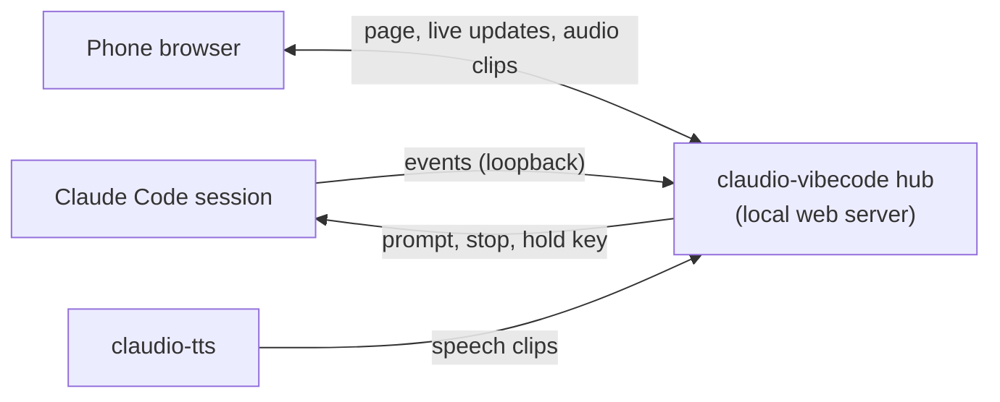

<div align="center">

# 📱 claudio-vibecode

### Run Claude Code from your phone. Read it, answer it, talk to it, hear it.

For vibe coders who don't sit at the monitor all day: start a task, grab a coffee, and keep going from a local web page on your phone. No native app, no account, nothing leaves your network.

[](https://github.com/restante/claudio-vibecode/actions/workflows/ci.yml)
[](LICENSE)
  

</div>

---

## ✨ What you get

| On your phone | How |
| --- | --- |
| **See the conversation** | Every Claude Code session on your computer, with transcript and spoken summaries |
| **Send a message** | One text box that mirrors Claude's prompt box. Tap **Speak**, edit, then **Send** |
| **Stop Claude** | While Claude is working, a row at the end of the conversation shows it (with the time so far) and a **Stop** button interrupts it |
| **Read a message aloud** | Tap the small speaker icon on any Claude message. It plays where Output is set (phone or computer); tap again to stop |
| **Mic and Output** | Two toggles above the Speak button, each **PC** or **Phone**. **Mic PC**: **Tap to speak** uses the computer's mic (Claude Code's voice key). **Mic Phone**: **Tap to speak** uses the phone's mic. **Output PC**: Claude's voice plays on the computer. **Output Phone**: it plays on the phone only. The phone mic needs [Tailscale](https://tailscale.com) with HTTPS certificates; the browser's speech service (Apple/Google) hears the audio |
| **Hear Claude** | With Output on Phone, Claude's voice plays on the phone (needs [claudio-tts](https://github.com/restante/claudio-tts)) and the computer stays quiet |
| **Feel it** | Haptic feedback on taps, Send and Stop (vibration on Android, a light tick on iPhone) |

Works on **iPhone and Android** in the phone's normal browser. Pair once with a **QR code**.

## 🚀 Install

You need [Claude Code](https://claude.com/claude-code) with mods support and about 1 GB of free disk for the voice model (installed by claudio-tts, which this installer fetches for you).

**macOS**

```bash
curl -fsSL https://raw.githubusercontent.com/restante/claudio-vibecode/main/install.sh | bash
```

**Windows (PowerShell, beta)**

```powershell
irm https://raw.githubusercontent.com/restante/claudio-vibecode/main/install.ps1 | iex
```

Then restart Claude Code and type:

```
/vibe
```

It starts the hub and shows a QR code. Scan it with your phone camera (same Wi-Fi). That's it.

## 🎮 Commands

| Command | What it does |
| --- | --- |
| `/vibe` or `/vibe on` | Start the hub and show a QR code to pair a phone |
| `/vibe qr` | A fresh QR code (for another phone) |
| `/vibe status` | Address, paired phones, connected sessions, voice-button readiness |
| `/vibe devices` · `revoke <id>` | List paired phones · remove one |
| `/vibe off` | Stop the hub and close the port |
| `/vibe update` | Install the newest release. `/vibe update check` only looks, `/vibe update off` stops the daily check |

On the phone page: **🔊 / 🔇** (this session's speech on/off), **Mic PC/Phone** (which mic Speak uses), **Output PC/Phone** (where Claude's voice plays).

## 🔊 Hearing Claude on the phone

claudio-vibecode plugs into [claudio-tts](https://github.com/restante/claudio-tts) as an extra audio output. Set **Output** to **📱 Phone** once (browsers need a tap before they allow sound) and every spoken reply plays on the phone, whatever your `/tts device` setting is, while the computer's speakers stay quiet. **🖥 PC** turns that off.

## 🔐 Security: please read

A paired phone can make Claude run tools on your computer, so treat it like a keyboard.

- Off until you run `/vibe`. It stops itself after 8 idle hours, and `/vibe off` closes the port at once.
- The QR holds a one-time code (5 minutes). The phone swaps it for its own token, stored hashed. Revoke any time.
- Every route needs that token; the pairing page only answers on the computer itself.
- The connection is plain `http` on your Wi-Fi: use a network you trust. For another network or encryption use [Tailscale](https://tailscale.com); `/vibe status` prints the Tailscale address when it is running.
- The page can't use the phone's microphone over plain `http` (browsers require HTTPS for that). Use the keyboard's dictation key, or set Mic to PC, where **Tap to speak** uses the computer's mic.

## 🧩 How it works



A small mod forwards each session's prompts and replies to the hub on `127.0.0.1` and carries out what the phone asks for (`$.prompt.submit`, `$.turn.abort`). The hub serves the phone page and relays Claude's speech from claudio-tts as short audio clips. See [docs/how-it-works.md](docs/how-it-works.md).

## 🖥️ Platforms

macOS is the tested platform. Windows is **beta** (automated tests only; see [docs/windows.md](docs/windows.md)). Linux is best effort.

## 🐞 Report a bug · 🤝 Contribute

Open an [issue](https://github.com/restante/claudio-vibecode/issues) (`claudio-vibecode doctor` output helps) or send a pull request. See [CONTRIBUTING.md](CONTRIBUTING.md).

## 🗑️ Uninstall

```bash
curl -fsSL https://raw.githubusercontent.com/restante/claudio-vibecode/main/install.sh | bash -s -- --uninstall
```

This removes claudio-vibecode and leaves claudio-tts alone.

## 🙏 Credits

- My friend [Donato Antonini](https://www.linkedin.com/in/donato-antonini-47b18a48/), for the brainstorming and the idea.
- [claudio-tts](https://github.com/restante/claudio-tts) and [Kokoro](https://huggingface.co/hexgrad/Kokoro-82M) for the voice.

## 📄 License

MIT. See [LICENSE](LICENSE).
